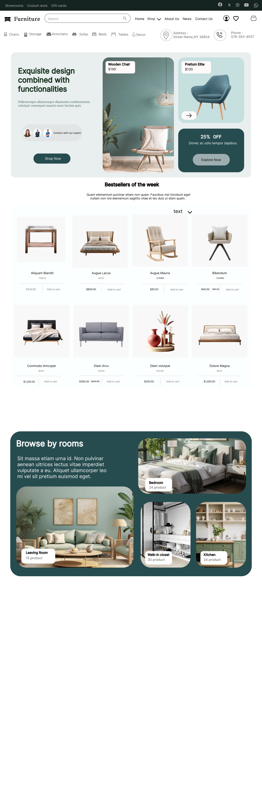

# 🪑 Furniture Website — UI/UX Design

  

<h3 align="center">
  ✨ Modern Furniture E-Commerce Website
</h3>

  A clean, modern and user-friendly furniture website designed in Figma.

  

---

## 📌 About The Project

This project is a modern **Furniture E-Commerce Website UI/UX Design** created using **Figma**.

The design focuses on creating a clean and attractive shopping experience where users can easily explore furniture products, view product details and navigate through the website.

---

## 🎯 Project Goals

- 🪑 Create a modern furniture shopping experience
- 🎨 Design a clean and attractive interface
- 🧭 Make website navigation simple and intuitive
- 🛍️ Present furniture products in an appealing way
- 📱 Create a user-friendly and responsive design concept

---

## ✨ Features

- 🏠 Modern Home Page
- 🪑 Furniture Product Showcase
- 🔍 Easy Product Browsing
- 🛒 E-Commerce Interface
- 📦 Product Details
- 🎨 Clean UI Design
- 🧭 Simple Navigation
- 📱 Responsive Design Concept
- ✨ Interactive Figma Prototype

---

## 🛠️ Tools & Technologies

| Tool | Purpose |
|---|---|
| 🎨 Figma | UI/UX Design & Prototyping |
| 🖼️ Figma Prototype | Interactive Website Flow |
| 💡 UI/UX Principles | User Experience & Interface Design |

---

## 🎨 Design Process

### 1️⃣ Research

Understanding the requirements of a modern furniture shopping website.

### 2️⃣ Wireframing

Planning the layout, navigation and placement of important elements.

### 3️⃣ UI Design

Creating the visual interface with typography, spacing, colors and product layouts.

### 4️⃣ Prototyping

Connecting screens in Figma to create an interactive user experience.

### 5️⃣ Refinement

Improving the overall usability and visual appearance of the design.

---

## 🖥️ Design Preview

  

---

## 🔗 Figma Prototype

---

## 📚 What I Learned

Through this project, I practiced:

- 🎨 UI Design
- 🧠 UX Thinking
- 📐 Layout & Spacing
- 🔤 Typography
- 🎨 Color Selection
- 🖼️ Product Presentation
- 🔗 Interactive Prototyping
- 🧭 User Navigation

---

## 👩‍💻 Designed By

### **Mansvi Unagar**

🎓 BSc IT Student  
🎨 UI/UX Designer  
💻 Developer & Tech Enthusiast

---

✨ <b>Thank you for visiting this project!</b> ✨

 

